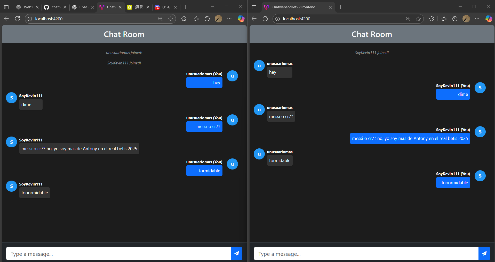
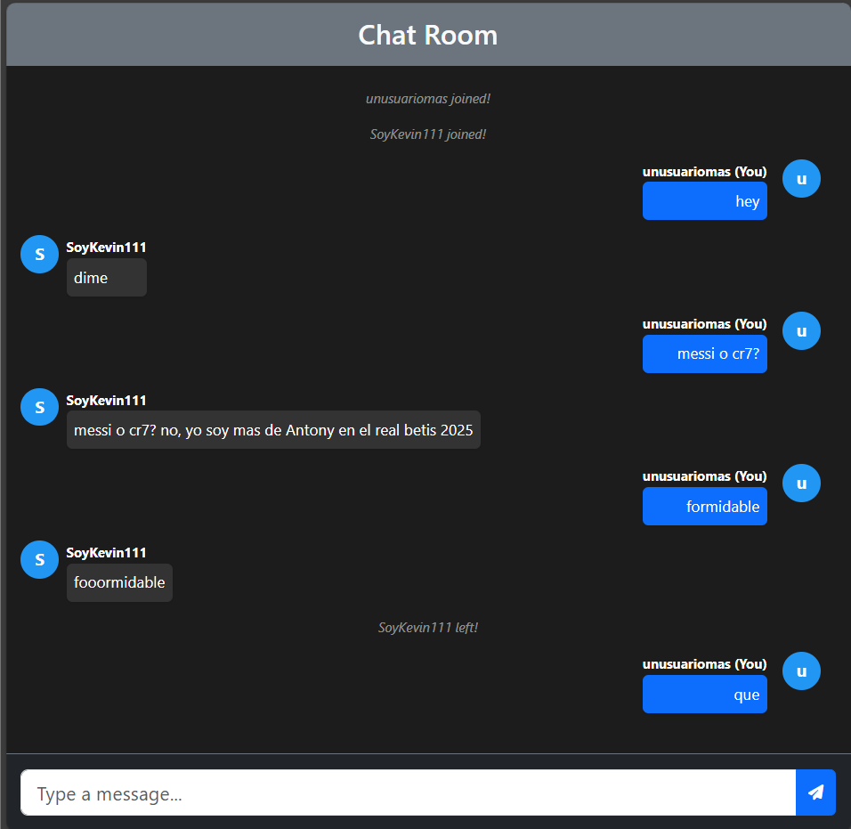

# 🟢 Chat simple en Tiempo Real con WebSockets

Este proyecto es un **chat grupal en tiempo real** construido con **Angular 18** en el frontend y **Spring Boot** en el backend.  
Permite simular varios usuarios conectados simultáneamente, utilizando **WebSockets** para establecer una **conexión bidireccional** entre cliente y servidor, logrando comunicación instantánea.

---

## ⚙️ Tecnologías utilizadas

- **Backend:** Spring Boot, WebSockets
- **Frontend:** Angular 18, Bootstrap
- **Comunicación en tiempo real:** SockJS, STOMP.js
- **Estilos y UI:** Bootstrap

---

## 💻 Funcionalidades

- Conexión simultánea de múltiples usuarios.
- Envío y recepción de mensajes en tiempo real.
- Mensajes almacenados temporalmente en memoria para simulaciones rápidas.

---

## 🖼 Capturas de pantalla

**Vista principal del chat:**

---
